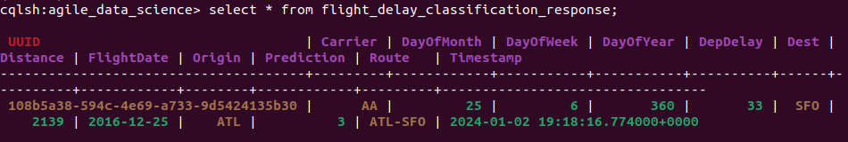
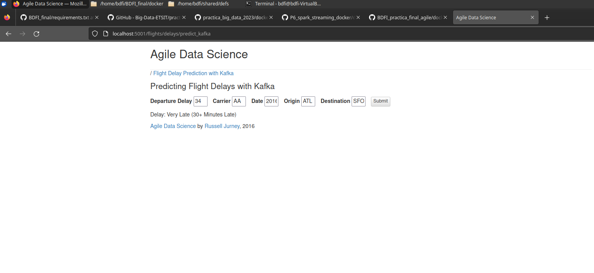
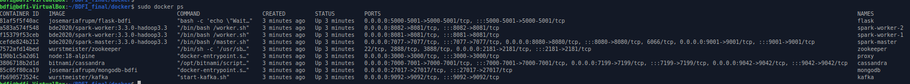
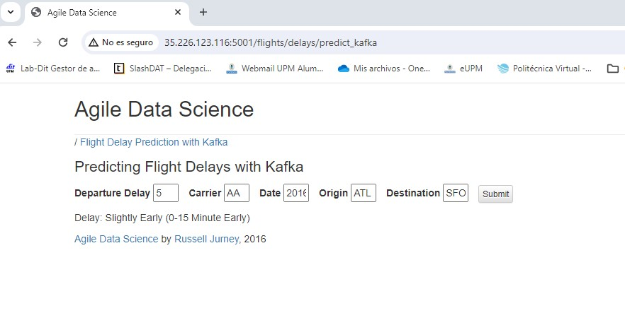

# Práctica final de BDFI
Autores:
 - José María Fernández Rodríguez
 - Gabriel Funes Gabaldón
---
Instrucciones de despliegue:
- **Opción automatizada**: Descargar el script `initiate_server.sh` de este repositorio y ejecutarlo en una máquina con SO basado en Ubuntu  con `./initiate_server.sh`.
- **Opción manual**: Ejecutar cada uno de los comandos del script `initiate_server.sh` de este repositorio, que son los siguientes:

    Actualización de repositorios e instalación de Git y PIP
    ```
    sudo apt update
    sudo apt install -y pip git
    ```

    Instalación de SDKMAN, Java 8, Spark y SBT
    ```
    curl -s "https://get.sdkman.io" | bash
    source "$HOME/.sdkman/bin/sdkman-init.sh"
    sdk install java 8.0.302-open
    sdk install spark 3.3.2
    sdk install sbt
    ```
    Clonación de repositorio y cambio de directorio al del repo
    ```
    git clone https://github.com/josemariafr-upm/BDFI_final
    cd BDFI_final/
    ```
    Entrenamiento de modelos
    ```
    export SPARK_HOME=$HOME/.sdkman/candidates/spark/3.3.2/
    export JAVA_HOME=$HOME/.sdkman/candidates/java/8.0.302-open
    pip install -r requirements.txt
    python3 resources/train_spark_mllib_model.py .
    ```
    Compilación y empaquetamiento del proyecto de Scala
    ```
    cd flight_prediction/
    sbt compile
    sbt package
    ```
    Despliegue de contenedores
    ```
    cd ../docker
    sudo docker compose up
    ```
## Índice

- [Introducción](#intro)
- [Desarrollo de los objetivos obligatorios](#obligatorio)
    - [Migración de MongoDB a Cassandra para los resultados de las predicciones](#cassandra)
    - [Dockerización del escenario](#docker)
    - [Despliegue del escenario en servidor en la nube](#nube)
- [Desarrollo de los objetivos opcionales](#opcional)
    - [Despliegue del escenario en Kubernetes](#k8s)

## Introducción <a id="intro"></a>

Esta es la entrega de la práctica final de la asignatura BDFI del segundo curso de MUIT, en la especialidad de Telemática, del curso 23-24.
La práctica se desarrolla a partir del repositorio original del cual se ha forkeado este mismo, es decir, el de [este enlace](https://github.com/Big-Data-ETSIT/practica_creativa), añadiendo al mismo las modificaciones necesarias para el cumplimiento de los objetivos, los cuales son los siguientes:

**Obligatorios**

- [X] Migración de MongoDB a Cassandra para el almacenamiento de los resultados de las predicciones
- [X] Dockerización del escenario
- [X] Despliegue del escenario en servidor en la nube (Google Cloud, MS Azure...)

**Opcionales**

- [ ] Despliegue del escenario en Kubernetes
- [ ] Migración a Kafka para los resultados de las predicciones
- [ ] Entrenamiento del modelo con Apache Airflow

Explicaremos a continuación lo realizado para completar cada objetivo.

---
## Objetivos obligatorios <a id="obligatorio"></a>

### Migración de MongoDB a Cassandra para los resultados de las predicciones <a id="cassandra"></a>

Para este objetivo desarrollamos a partir del despliegue en la máquina local sin dockerizar, para lo cual hay que seguir las instrucciones indicadas en el [repositorio enunciado](https://github.com/Big-Data-ETSIT/practica_creativa). Además de ello es necesario instalar la base de datos Cassandra, para lo cual se siguen las instrucciones de [este enlace](https://cassandra.apache.org/doc/latest/cassandra/installing/installing.html). Una vez en marcha estará funcionando en el puerto 9042. Por último se configura la base de datos (keystore) y tabla con los nombres de base de datos y colección que se usa en MongoDB para esa parte, lo cual se puede ver bien accediendo a la colección de MongoDB del escenario original, o analizando el código del `MakePrediction.scala`. Para ello se accede por cqlsh a Cassandra y se ejecutan las siguientes queries:

Creamos la keyspace:

```
CREATE KEYSPACE IF NOT EXISTS agile_data_science WITH replication = {'class': 'SimpleStrategy', 'replication_factor': 1};
```

Indicamos la keyspace a utilizar para crear la tabla:

```
USE agile_data_science;
```

Creamos la tabla, para la cual hay que tener en cuenta que los campos llevan mayúsculas, por lo que la query necesita de las comillas dobles para que Cassandra respete las mayus. En caso de no ponerlas los campos se crean con minúsculas, y al ser el .scala sensible a las mismas la inserción de datos no funcionará:

```
CREATE TABLE IF NOT EXISTS flight_delay_classification_response (    
    "Origin" text,
    "DayOfWeek" int,
    "DayOfYear" int,
    "DayOfMonth" int,
    "Dest" text,
    "DepDelay" double,
    "Timestamp" timestamp,    
    "FlightDate" timestamp,
    "Carrier" text,
    "UUID" text,
    "Distance" double,
    "Route" text,
    "Prediction" int,
    PRIMARY KEY ("UUID") 
);
```

Estas tres queries las utilizaremos en la creación del docker de Cassandra tal y como veremos más adelante.

A continuación modificamos el código de MakePrediction.scala en el punto donde escribe los datos de las predicciones en MongoDB para que en cambio los escriba en Cassandra. Para ello importamos el conector de Spark para Cassandra (aunque en el spark-submit indicaremos el paquete):

`import com.datastax.spark.connector._`

Y a continuación modificamos el dataStreamWriter, que es el elemento que se encarga de escribir el stream de datos donde se le indique:

```
val dataStreamWriter = finalPredictions
      .writeStream
      .format("org.apache.spark.sql.cassandra") //Indicamos formato
      .outputMode("append")
      .option("spark.cassandra.connection.host", "127.0.0.1") //Dirección de la máquina donde está Cassandra
      .option("spark.cassandra.connection.port", "9042") //Puerto donde escucha Cassandra
      .option("spark.cassandra.auth.username", "cassandra") //Usuario y contraseña en caso de que se hayan configurado
      .option("spark.cassandra.auth.password", "cassandra")
      .option("keyspace", "agile_data_science") //Keyspace donde se encuentra la tabla
      .option("table", "flight_delay_classification_response") //Tabla sobre la que escribir
      .option("checkpointLocation", "/tmp")
      .option("confirm.truncate", true)
```

Por último es necesario modificar también el `predict_flask.py` (localizado en resources/web/), el cual accede a las predicciones para mostrarlas en la web:

Importamos los módulos necesarios:

```
from cassandra.cluster import Cluster
from cassandra.query import ordered_dict_factory
from cassandra.auth import PlainTextAuthProvider
```

Añadimos las siguientes líneas para conectarnos a Cassandra, seleccionando la Keyspace que queremos:

```
## SETUP CASSANDRA
auth_provider = PlainTextAuthProvider(username='cassandra', password='cassandra')
cluster = Cluster(["127.0.0.1"],auth_provider = auth_provider) # De nuevo, en cuanto cambiemos a dockers hay que cambiar la ip
session = cluster.connect('agile_data_science')

session.row_factory = ordered_dict_factory # Aquí indicamos que los resultados de las queries sean en forma de diccionarios
```

En la definicion de la función `classify_flight_delays_realtime_response(unique_id)`(prácticamente al final del archivo), la cual obtiene de la BBDD la predicción correspondiente al unique_id que obtiene por argumento, borramos las líneas correspondientes a la obtención desde MongoDB por las siguientes:

```
cql = "SELECT * FROM flight_delay_classification_response WHERE \"UUID\"='" + unique_id + "'" # Query a realizar para obtener sólo las entradas con la unique_id indicada (que debería ser sólo una)
  
r = session.execute(cql) # Ejecutamos la Query en Cassandra, obteniendo la lista de entradas (una lista con sólo una entrada) y la guardamos en 'r'
  
prediction = r.one() # Obtenemos una entrada de la lista (la única que debería haber) y la guardamos en la variable 'prediction'
```
Después de estos cambios (habiendo recompilado y reempaquetado el .scala) tenemos el cambio realizado correctamente, para lo cual probamos la web (http://localhost:5001/flights/delays/predict_kafka), y además podemos revisar la tabla de Cassandra:



### Dockerización del escenario <a id="docker"></a>

Previo a la dockerización del escenario analizamos qué elementos hay que dockerizar, teniendo la siguiente lista:

- Kafka y Zookeeper
- MongoDB
- Cassandra
- Spark (incluye 1 spark-master, 2 spark-workers y 1 spark-submit)
- Flask

Hemos intentado dockerizar adicionalmente el entrenamiento de los modelos (ejecución de `resources/train_spark_mllib_model.py`) y la compilación y paquetización del .scala con sbt, pero no ha sido posible. Para paliar eso se ejecuta el `train_spark_mllib_model.py` siguiendo las instrucciones del enunciado, así como compilamos y empaquetamos el proyecto de Scala previo a lanzar los contenedores.

A continuación comentamos las imágenes utilizadas para cada uno:

**Zookeeper:** `wurstmeister/zookeeper`

**Kafka:** `wurstmeister/kafka`, la cual mediante la configuración de la variable de entorno KAFKA_CREATE_TOPICS en el docker-compose.yml se le indica el topic a crear, así como el factor de replicación y número de particiones. 

Para ambos dockers se ha seguido la información de [este sitio web](https://www.baeldung.com/ops/kafka-new-topic-docker-compose).

**MongoDB:** `josemariafrupm/mongodb-bdfi`, la cual es una imagen construida por nosotros, para la cual hemos construido el Dockerfile de la carpeta docker/mongodb de nuestro repositorio, el cual copia el .jsonl de data/ así como el script de resources/import_distances.sh para que lo ejecute al iniciar el contenedor, importando los datos necesarios en la misma.

**Cassandra:** `bitnami/cassandra`, al cual en el docker-compose.yml le indicamos el script `create_prediction_table.cql` (que se encuentra en docker/cassandra) quese ejecuta al iniciar el contenedor y crea la keyspace y tabla ejecutando las queries indicadas en el primer objetivo. Además se configuran usuario y contraseña con las variables de entorno necesarias.

**Spark:** `bde2020/spark-master:3.3.0-hadoop3.3`, `bde2020/spark-worker:3.3.0-hadoop3.3` y `bde2020/spark-submit:3.3.0-hadoop3.3`, de igual forma que se hizo en la práctica de [este repositorio](https://github.com/Big-Data-ETSIT/P6_spark_streaming_docker), con la diferencia de las versiones de Spark y Hadoop. Asimismo, el comando a ejecutar por el contenedor spark-submit (donde se indica el nodo master del cluster y los paquetes a utilizar, así como la clase) es el siguiente:

```
/spark/bin/spark-submit --class es.upm.dit.ging.predictor.MakePrediction --master  spark://spark-master:7077 --packages org.mongodb.spark:mongo-spark-connector_2.12:10.1.1,org.apache.spark:spark-sql-kafka-0-10_2.12:3.3.0,com.datastax.spark:spark-cassandra-connector_2.12:3.3.0,com.github.jnr:jnr-posix:3.1.18 BDFI_final/flight_prediction/target/scala-2.12/flight_prediction_2.12-0.1.jar
```

**Flask:** `josemariafrupm/flask-bdfi`, imagen propia basada en `python:3.11.7-slim-bookworm` sobre la cual se instalan los requisitos del requirements.txt con pip, para lo cual descarga el repositorio con git (previa instalación del mismo), instala los requirements, y borra de nuevo el repositorio tras la instalación para reducir el tamaño de la imagen (grande de por sí). Otra forma de crear la imagen sin necesidad de git hubiera sido, mediante instalación de wget, descargar sólo el requirements.txt con el comando `wget https://raw.githubusercontent.com/josemariafr-upm/BDFI_final/master/requirements.txt`, ahorrando un paso.

Con todos estos contenedores (además del proxy que se usa en la práctica de spark-submit), se crea el docker-compose.yml de este repositorio. Para no copiar el repositorio en todos los contenedores se ha decidido configurar volúmenes en el docker-compose para que todos ellos utilicen el repositorio previamente descargado en el host donde se despliegan. Adicionalmente se han añadido algunos tiempos de espera (en los contenedores de spark-submit y flask) para controlar el orden de ejecución de los mismos de tal forma que le de tiempo al resto de contenedores a crear las bases de datos, topics, etc. necesarios. Además, tal y como se ha mencionado previamente, las IPs de kafka, mongo y cassandra hay que cambiarlas en el `MakePrediction.scala` y `predict_flask.py` por los nombres de los contenedores, quedando como archivos finales los presentes en el repositorio.

Como resultado tenemos funcionando la web de nuevo en http://localhost:5001/flights/delays/predict_kafka:





### Despliegue del escenario en servidor en la nube <a id="nube"></a>

Para el despliegue en servidor en la nube hemos creado el script initiate_server.sh, cuya ejecución automatiza el despliegue del escenario (las instrucciones están al inicio de este README). Los comandos que ejecuta a grandes rasgos son los siguientes:

- Actualiza la lista de repositorios de la VM e instala git y pip.
- Instala SDKMAN, para con ello instalar java, spark y sbt.
- Clona este repositorio, exporta las variables necesarias, instala las dependencias de pip y entrena los modelos.
- Entra en la carpeta del proyecto de Scala (flight_prediction) y compila y empaqueta el mismo con sbt.
- Por último, entra en la carpeta docker y despliega los contenedores.

Una vez arrancado el escenario se puede acceder al mismo, esta vez en la dirección http://<DIRECCIÓN_SERVIDOR>:5001/flights/delays/predict_kafka (la dirección web del servidor se deberá extraer de la página de gestión de la VM; además se deberá haber configurado en el firewall de la plataforma que el puerto 5001 sea accesible desde el exterior):



## Objetivos opcionales <a id="opcional"></a>
### Despliegue del escenario en Kubernetes <a id="k8s"></a>

Se han desarrollado los diferentes archivos yaml para el despliegue en K8s, además de un script de despliegue automatizado que hace los kubectl apply de manera gradual (y con sleeps intermedios para dar tiempo a los pods a desplegarse). Por orden de despliegue:

- **namespace.yaml:** crea el namespace con nombre 'bdfi', en el cual se desplegarán los servicios, deployments y pods.
- **kafkazk.yaml:** Crea un servicio con dos deployments (uno para Zookeeper y otro para Kafka).
- **mongodb.yaml:** Crea un servicio y deployment para el componente de MongoDB, que ya contendrá los datos precargados.
- **cassandra.yaml:** Crea el servicio y despliegue de la base de datos de Cassandra. Para ello monta un volumen que apunta directamente al script de creación del keyspace y tabla necesaria (de igual manera que ocurre en el docker-compose de la parte obligatoria de la práctica).
- **spark.yaml:** Crea un servicio con dos deployments: uno para el conjunto de spark-master y spark-submit, y otro para los spark-worker, indicando un sólo contenedor pero definiendo el número de réplicas que deseamos (2 en nuestro caso). También hacen uso del directorio de la práctica de la máquina host con el uso de volúmenes.
- **flask.yaml:** Crea servicio y deployment para flask, una vez más haciendo uso del directorio directo del host.

Dicho todo esto, no hemos sido capaces de ponerlo en marcha correctamente, y por tanto no se ha probado el despliegue completo de este escenario.


